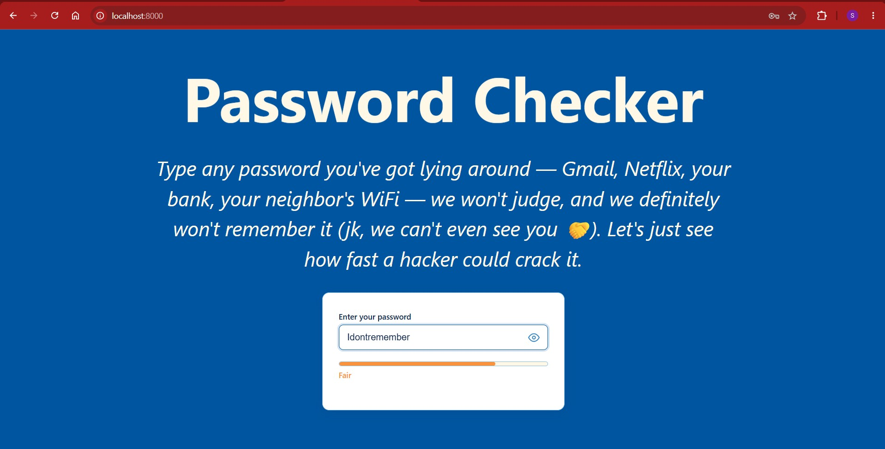
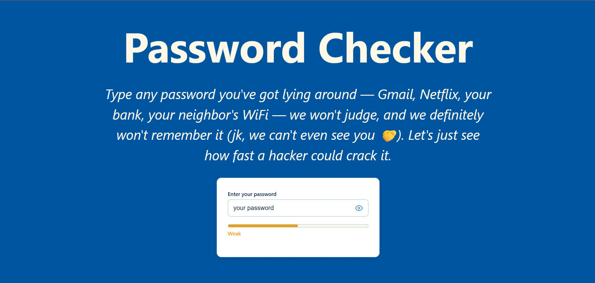
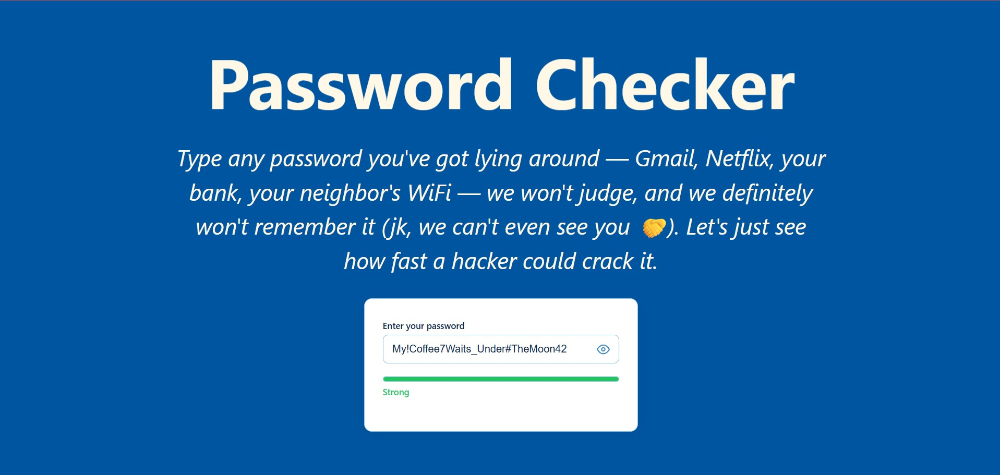
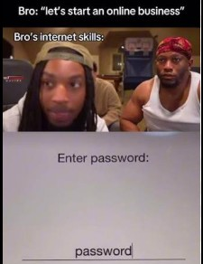

# 🔐 Password Checker
An simple **client-side** password strength checker. 
Type a password, watch a bar change color, feel things about your life choices. 
- No backend,
- no database,
- no "we've sent your password to our servers for analysis"

**Whatever happens in the browser, stays within the browser.**

**[👉 Try it live here](https://hwushyam2005.github.io/Password_checker/)**

---

## What does it actually do?

You type a password. It gets judged — instantly and silently, the way your group chat judges your fashion choices.

The bar goes:

🔴 **Poor** → 🟠 **Weak** → 🟠 **Fair** → 🟢 **Strong**

And it checks for:

- ✅ At least 8 characters (yes, `12345` doesn't count, nice try)
- ✅ At least one UPPERCASE letter
- ✅ At least one lowercase letter
- ✅ At least one number
- ✅ At least one special character (`!@#$%^&*` etc.)
- ✅ **Not** a painfully common password (looking at you, `password123`)

Also has a 👁️ show/hide toggle, because squinting at dots to remember what you typed is not a personality trait.

---

## 📸 Proof it works 

| Fair | Weak | Strong |
|---|---|---|
|  |  |  |

---

## 🛠️ Tech Stack

Nothing fancy. No frameworks. No `node_modules` folder eating your storage.

- **HTML** — structure
- **CSS** — the "bird ocean" color palette, an animated floating title, and shadows on hover so it feels alive
- **Vanilla JavaScript** — all the logic, zero dependencies

That's it. That's the stack.

---

## 📁 Project Structure

```
Password_checker/
├── index.html              # The page itself
├── css/
│   └── styles.css          # All the styling + colors + animations
├── js/
│   ├── commonPasswords.js  # Blacklist of "creative" passwords like qwerty
│   ├── passwordEngine.js   # Rules + checking logic + scoring, all in one
│   └── main.js              # Wires everything to the actual page
├── imgref/                 # Screenshots used in this README
├── assets/icons/           # Reserved for icons (currently empty, shh)
└── README.md                # You are here
```

---

## 🚀 Running it locally

No installs. No `npm install` waiting 10 minutes for 400MB of dependencies you'll never use.

1. Clone the repo
   ```bash
   git clone https://github.com/HwuShyam2005/Password_checker.git
   ```
2. Open `index.html` in your browser. That's it. You're done. Go outside.

*(Optional, for that "I'm a real developer" feeling: run it with `python -m http.server 8000` and visit `localhost:8000`.)*

---

## 🌐 Deployment

Hosted for free on **GitHub Pages** — because paying for hosting on a password strength checker feels like buying insurance for a paperclip.

Live at: **https://hwushyam2005.github.io/Password_checker/**

---

## ⚠️ A Note on Privacy

Everything runs **entirely in your browser**. Nothing you type is sent anywhere, stored anywhere, or seen by anyone — including us. We built a password checker, not a password *collector*. There's a difference, and we care about that difference deeply.

---

## The meme which was the starting point of this project



## 🙏 Final Words

If your password is currently `password`, `123456`, or your pet's name followed by the year you were born — this tool was made with you specifically in mind. No judgment. Okay, some judgment. But mostly love.
